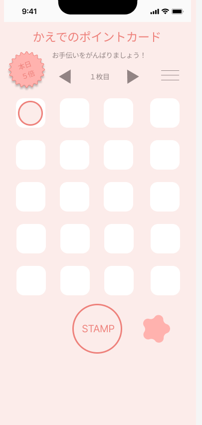
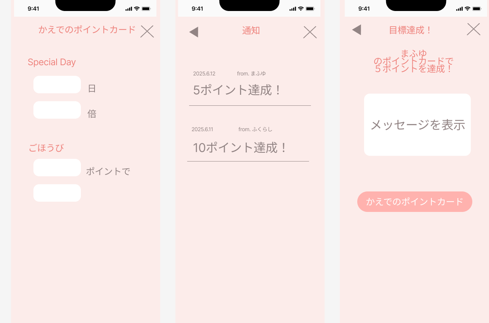

# サービスのURL
[ふたりポイントカード](https://futari-point.onrender.com/users/sign_in)

 

# アプリケーション概要
### 夫婦や親子など、2人のいいところを見つけたらスタンプを押す

 

### スタンプカードが満タンになったらごほうびを与え合おう

 

# 工夫した点
- スタンプが貯まるごとに報酬通知を送る 独自ロジックをモデル層に実装

- 満タン通知と報酬通知を1つのメソッドでまとめて処理することで保守性を確保

- Devise を活用し、親と子のユーザーを簡潔に認証管理

- RSpec + FactoryBot による モデル・リクエスト・システムテスト を実装

- Bootstrap をSCSSでカスタマイズし、子どもにも親しみやすいデザインを工夫

- GitHub Actionsで 自動テスト実行のCIパイプラインを整備

# 使用技術
| Category          | Technology Stack                                     |
| ----------------- | --------------------------------------------------   |
| Frontend          | Bootstrap 5 / Turbo Streams                       |
| Backend           | Ruby on Rails 8                           |
| Infrastructure    | Render                          |
| Database          | PostgreSQL                                           |
| CI/CD             | GitHub Actions / RSpec                                   |

 

# ER図
